Orientations Vignette
================
Shannon P. McPherron
2019-03-19

``` r
library(knitcitations)
library(xtable)
library(dplyr)
options(xtable.comment = FALSE)
```

This vignette documents the use of a set of R functions ('orientations.R') designed to analyzed and visualize orientation data (bearing and plunge). The statistics and methods presented here are described in more detail in (S. J. McPherron 2005; S. P. McPherron 2018) and citations within. To replicate the specific examples given here requires the data file 'LF\_orientations.RDS' and the functions file 'orientations.R'. The following code loads both of these (note too the use of *xtable* and *dplyr* in some of the examples provided here).

``` r
lf = readRDS('..\\LF_orientations.RDS')
source("..\\orientations.R")
```

Take a look at the structure of the *lf* data frame.

``` r
str(lf)
```

    ## 'data.frame':    2087 obs. of  12 variables:
    ##  $ LEVEL     : chr  "1" "1" "1" "1" ...
    ##  $ CODE      : chr  "OS" "OS" "OS" "OS" ...
    ##  $ LENGTH    : num  NA NA NA NA NA NA NA NA NA NA ...
    ##  $ WIDTH     : num  NA NA NA NA NA NA NA NA NA NA ...
    ##  $ elongation: num  NA NA NA NA NA NA NA NA NA NA ...
    ##  $ obj_length: num  0.064 0.055 0.049 0.051 0.054 0.061 0.104 0.066 0.046 0.085 ...
    ##  $ X1        : num  106 107 107 107 107 ...
    ##  $ Y1        : num  105 106 105 105 105 ...
    ##  $ Z1        : num  -2.76 -2.5 -2.53 -2.55 -2.54 ...
    ##  $ X2        : num  106 107 107 107 107 ...
    ##  $ Y2        : num  105 106 105 105 105 ...
    ##  $ Z2        : num  -2.78 -2.51 -2.55 -2.55 -2.55 ...

The functions presented here are based on data prepared one of two ways. First, as shown here, a data frame with at least six columns (*X1*, *Y1*, *Z1*, *X2*, *Y2*, and *Z2* - note fields are case sensitive) listing the XYZ coordinates of the end points of a series of objects (one object per row). Alternatively, second, the data can be represented by a data frame of at least two columns (*bearing* and *plunge*) representing the horizontal bearing and the vertical plunge of a series of objects (see example on [GitHub site](https://github.com/surf3s/Orientations/tree/master/Convert%20Bearing%20and%20Plunge) for how to convert from bearing and plunge angles to XYZ coordinates suitable for orientations.R).

In the sample provided here, the *LEVEL* field is included to provide break downs of orientations by archaeological level, *CODE* to know what kind of object it is, *LENGTH* and *WIDTH* report caliper measurements on lithics, elongation is computed from these caliper measurements, and *obj\_length* is computed using the Euclidian distance between the two measured points. None of these fields are required, but they were used in the PLOS One publication (S. P. McPherron 2018).

The function *plunge\_and\_bearing()* is provided to compute these two angles from XYZ coordinate pairs:

``` r
lf_pb = plunge_and_bearing(lf)
str(lf_pb)
```

    ## 'data.frame':    2087 obs. of  2 variables:
    ##  $ plunge : num  20.24 8.42 19.14 2.26 7.39 ...
    ##  $ bearing: num  309.56 2.12 183.73 341.57 178.94 ...

To have basic statistics on either XYZ coordinate pairs or bearing and plunge angles, use the function *circular\_statistics()*. It provides the average bearing and plunge angles, the bearing variance, the plunge standard deviation, and the vector magnitude statistic (mean resultant length). These values are based on the *r.test*, *circ.mean*, *circ.disp* functions in the package CircStats. Bearing probabilities are based on a Rayleigh Test. Plunge probabilities are based on a Kolmogorov-Smirnov Test. For XYZ coordinate pairs, the mean and standard deviation of the Euclidian distances between each point pair are also provided:

``` r
print(xtable(circular_statistics(lf)), scalebox='0.6', floating = FALSE)
```

To have the same statistics by archaeological level:

``` r
print(xtable(circular_statistics(lf, level = lf$LEVEL)), scalebox = '.65', floating = FALSE)
```

Note that by default, orientations statistics are not computed for samples of less then 50. To override this, use the min\_sample argument \[e.g. circular\_statistics(lf, level = lf$LEVEL, min\_sample = 30)\].

To have these same results from a dataframe of only bearing and plunge values, use with the same options:

``` r
print(xtable(circular_statistics(lf_pb, level = lf$LEVEL)), scalebox = '.65', floating = FALSE)
```

To have a Rose diagram for the data:

``` r
rose_diagram(plunge_and_bearing(lf)$bearing, main = "Bearing")
```

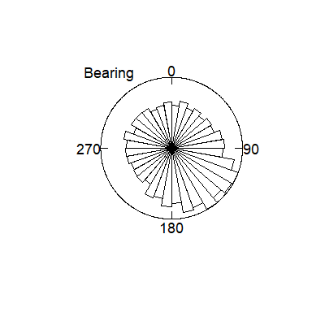

And to have this by level with a grey background and black bars:

``` r
layout(matrix(c(1:9), nrow = 3, ncol = 3))
rose_diagram(plunge_and_bearing(lf)$bearing, level = lf$LEVEL, 
             main = levels(factor(lf$LEVEL)),
             bg = "grey75", bar_col = 'black')
```

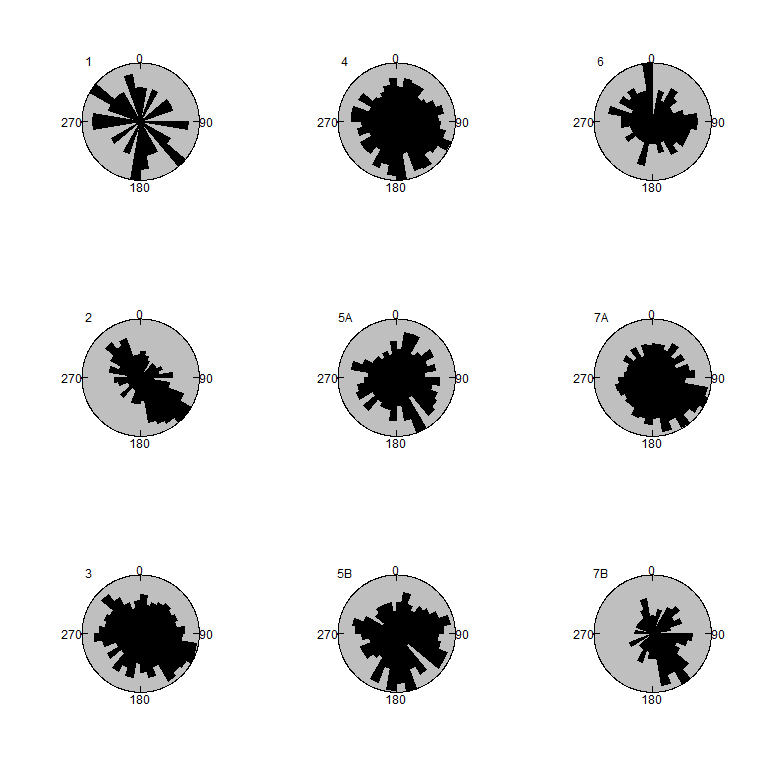

``` r
layout(matrix(c(1), nrow = 1, ncol = 1))
```

To have the points themselves added there are two options. First, you can add them to the periphery:

``` r
rose_diagram(plunge_and_bearing(lf %>% filter(LEVEL=='7B'))$bearing,
             pts_on_edge = TRUE, pch = 19,
             bg = "grey75", bar_col = 'grey50', main = "Level 7B")
```

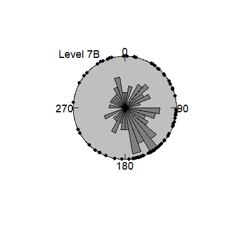

Second, you can combine a Schmidt diagram (lower hemisphere) with a Rose diagram as follows:

``` r
rose_diagram(angles = plunge_and_bearing(lf %>% filter(LEVEL=='7B')),
             pts_schmidt = TRUE, pch = 19,
             bg = "grey75", pnt_col = 'red', main = "Level 7B")
```

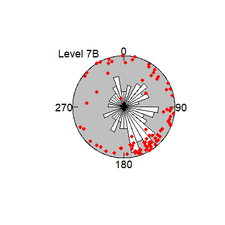

To have only a Schmidt diagram:

``` r
schmidt_diagram(angles = plunge_and_bearing(lf %>% filter(LEVEL=='7B')),
             pts_schmidt = TRUE, pch = 19, col = "red",
             bg = "grey75", main = "Level 7B")
```

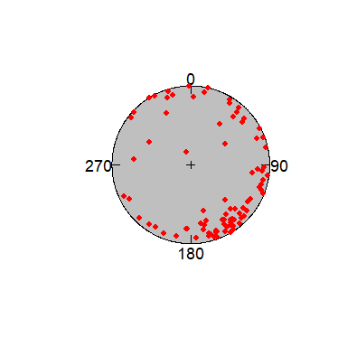

And to have a Schmidt diagram by level:

``` r
layout(matrix(c(1:9), nrow = 3, ncol = 3))
schmidt_diagram(angles = plunge_and_bearing(lf),
                level = lf$LEVEL,
                pts_schmidt = TRUE, pch = 19,
                bg = "grey75", main = paste("Layer",levels(factor(lf$LEVEL))))
```

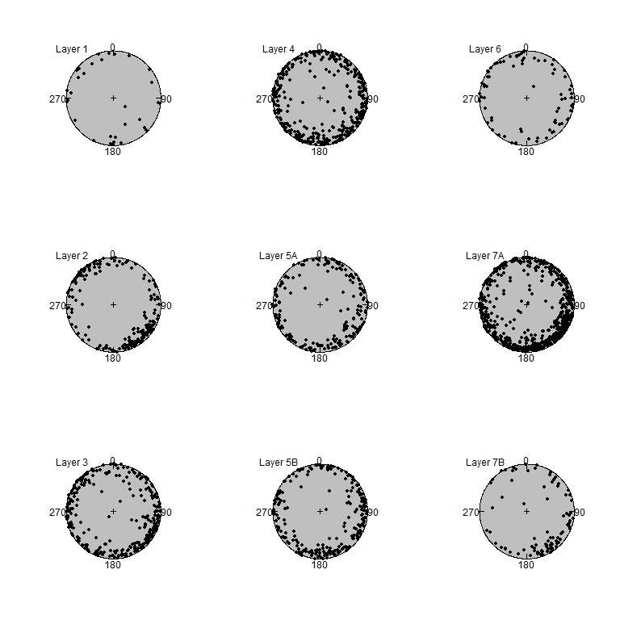

``` r
layout(matrix(c(1), nrow = 1, ncol = 1))
```

To make a Rose diagram only for plunge angles (here further filtered using *dplyr* to just Level 7B), use:

``` r
rose_diagram_plunge(plunge_and_bearing(lf %>% filter(LEVEL=='7B'))$plunge,
                    main="Plunge", bg = 'grey25', bar_col = 'grey75')
```

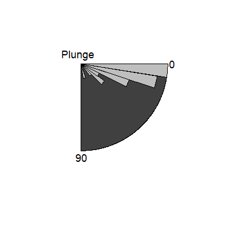

To plot the spatial distribution of the points used for orientations, you can apply:

``` r
plot_2shot(lf %>% filter(LEVEL=='7B'), main = "Layer 7B")
```

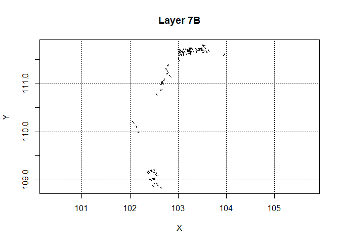 The use of GeoTIFF images is supported. GeoTIFF images have a corresponding world file (files with in this case an extension of *.tfw*).

``` r
plot_2shot(lf %>% filter(LEVEL=='7B'), main = "Layer 7B",
           background = "..\\The Whole Site (small).tif", color_codes = 'red')
```

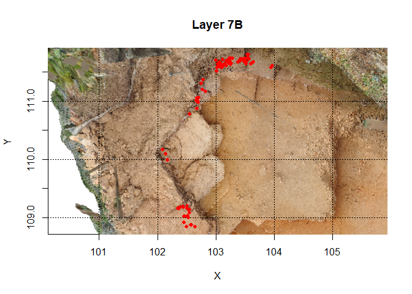

Though not shown here, the *plot\_2shot()* function also takes a level argument to create a series of plots.

To compute Eigenvalues and Benn shape ratios for an assemblage:

``` r
xtable(benn(xyz = lf, level = lf$LEVEL, min_sample = 30))
```

To plot these in a Benn diagram, follow this function:

``` r
benn_lf = benn(xyz = lf, level = lf$LEVEL, min_sample = 30)
benn_diagram(benn_lf, id = rownames(benn_lf),
             main = "",
             cex = 1.2,
             labels = "outside")
```

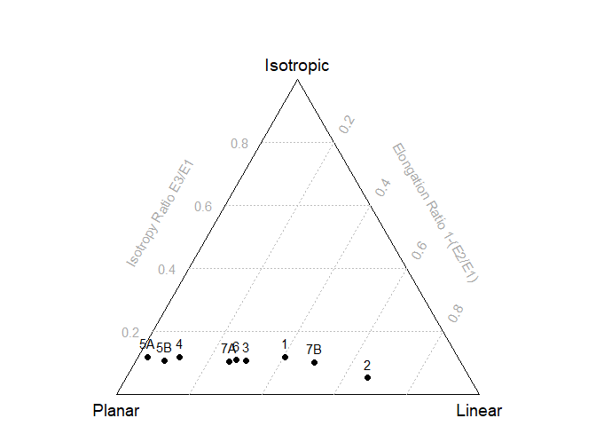

One of the important motivations for developing this software was to be able to have an assessment of the effect of sample size on confidence. You can do this now using resampling as follows:

``` r
benn_diagram(benn(xyz = lf %>% filter(LEVEL=='7B'), min_sample = 30),
             id = '7B',
             main = "",
             cex = 1.2,
             labels = "outside")
resampling_contours = benn_resampling(lf %>% filter(LEVEL=='7B'),
                                      resampling = 5000, p = .95) 

for (contour in resampling_contours)
  lines(benn_coords(cbind(elongation = contour$x, isotropy = contour$y))) 
```

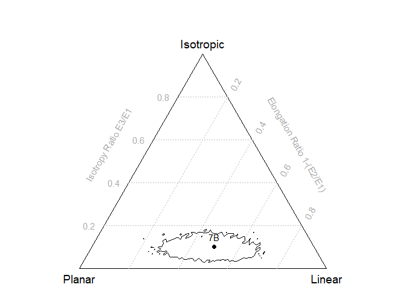

You can also use the functions *benn\_permutations()* and *benn\_permutations\_by\_level()* to do pairwise comparisons between orientation data sets. In the La Ferrassie data set, for example, we have a code that indicates whether the object is a bone (OS in French) or a stone (SILEX in French). We can compute the probability (p value) that they come from the same population of orientations as follows (with resampling set at 1000):

``` r
permutations = benn_permutations(lf %>% filter(CODE=='OS'),
                                 lf %>% filter(CODE=='SILEX'),
                                 resampling = 1000)
```

The result, in this case 0.235, is value can be used to frame a significance test (e.g. p &lt; .05) or can be used as a kind of sliding scale to measure the magnitude of differences in the orientations of sets of objects. This is important because it takes into consideration the sample size and allows one to assess whether points plotting in separate locations in the Benn diagram are really all that different or not.

To do the same for multiple comparisons (here by layer at La Ferrassie) follow the example below. Note that the function *benn\_permutations\_by\_level()* returns a list with two items. The first is a set of segments that can be used on the Benn diagram to connect samples that have similiar orientations. The second item, *results*, is a matrix of pair-wise comparisons.

``` r
permutations = benn_permutations_by_level(lf, level = lf$LEVEL,
                                          resampling = 1000)
print(xtable(permutations$result))
```

Finally, to put all of the plotting methods together, a function *orientations()* is provided.

``` r
layout(m = matrix(c(1,1,1,1,1,1,2,3,4), nrow = 3, ncol = 3))
result = orientations(lf %>% filter(LEVEL=='7B'), overlay = NULL,
                           spatial_benn = TRUE, 
                           background_image = "..\\The Whole Site (small).tif",
                           main = 'Layer 7B')
```

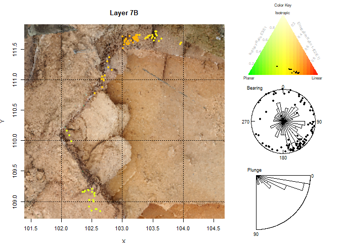

Note that there are additional functions in orientations.R not yet documented here. Also note that I do not yet have a proper manual for the functions. For now I rely on this document and the rMarkdown document that accompanies my PLOS One 2018 paper.

McPherron, S. J.P. 2005. “Artifact Orientations and Site Formation Processes from Total Station Proveniences.” *Journal of Archaeological Science* 32 (7): 1003–14. doi:[doi: DOI: 10.1016/j.jas.2005.01.015](https://doi.org/doi: DOI: 10.1016/j.jas.2005.01.015).

McPherron, Shannon P. 2018. “Additional Statistical and Graphical Methods for Analyzing Site Formation Processes Using Artifact Orientations.” *PLOS ONE* 13 (1): e0190195. doi:[10.1371/journal.pone.0190195](https://doi.org/10.1371/journal.pone.0190195).
